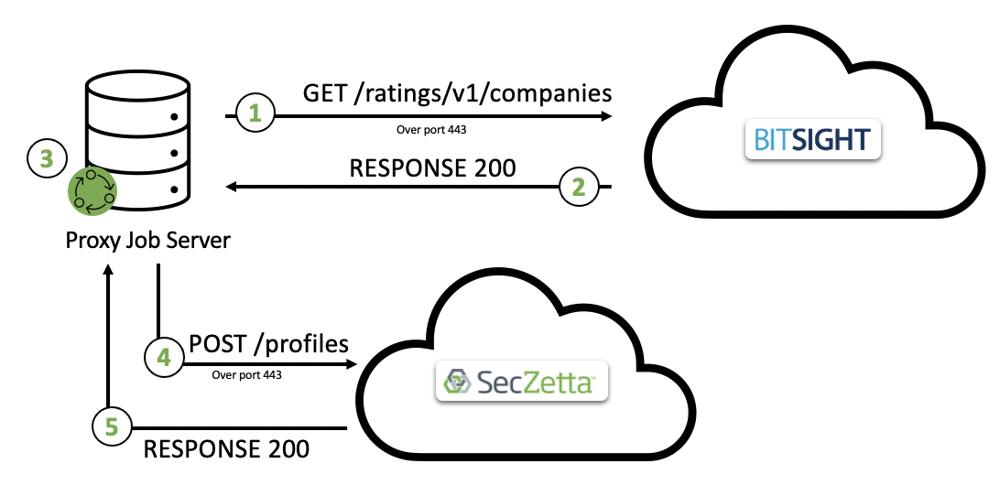

# SecZetta / BitSight Integration

## Overview
Organizations are often in the dark when it comes to understanding the actual security performance of critical third parties or even assessing the impact of their own security programs and policies. This is due to a lack of objective metrics and tools that help measure and mitigate cyber risk across the business ecosystem.

BitSight pioneered the security ratings market, founding the company with a solitary mission: to transform how organizations evaluate risk and security performance by employing the outside-in model used by credit rating agencies.

SecZetta is able to utilize this robust cyber risk data to apply directly to not only organizations but to apply that risk to the underlying identities associated with those organizations. This allows our customers to use this risk data inside SecZetta workflows and also passed down to our other partner integrations (IAM / PAM)

The below diagram gives a high level architecture diagram

- Step 1: Call BitSight to grab all companies risk ratings
- Step 2: BitSight responds back with the risk ratings
- Step 3: Proxy Job server analyzes risk rating and normalizes risk score to pass to SecZetta
- Step 4: Proxy Job server pushes risk data to Vendor profiles
- Step 5: Success response sent back

## Supported Features

- Sync BitSight risk rating to SecZetta 

## Prerequisites

## Configuration

### SecZetta Config

### BitSight Config
