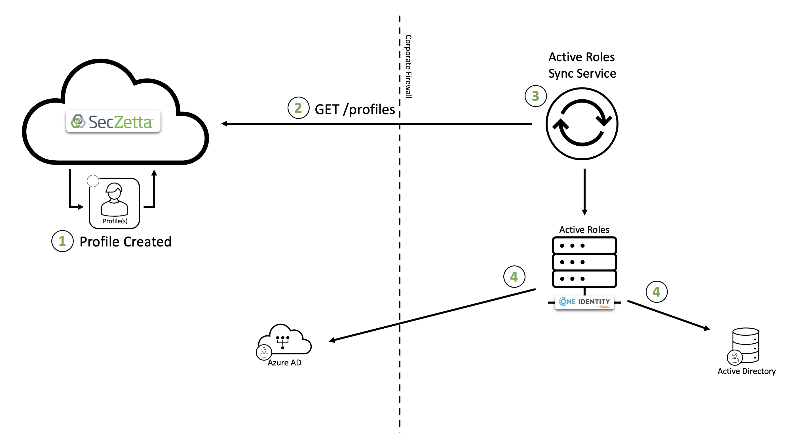

# SecZetta / Active Roles Integration

## Contents

## Overview

Often times customers have the need to do some very basic automated account creation for their non-employees. SecZetta has partnered with Quest's Active Roles to do just that. This is by no means a direct replacement for a more robust IAM system, there is a very specific set of use cases this integrations looks to solve. This integration essentially allows customers to 'sync' profiles to Active Directory (there by automatically creating accounts for new profiles and removing accounts for terminated profiles). Active roles is laser focused on the Microsoft directory stack. So On-prem Active Directory and Azure Directory are going to be the systems that this integration was designed to work with. 

According to the Quest Active Roles website, Active Roles allows customers to 'extend and enhance native capabilities of Active Directory and Azure Active Directory with One Identity Active Roles. Accelerate account, group and directory management and eliminate manual processes to increase efficiency and security. Focus on other IT tasks knowing your critical data, user permissions and privileged access are under control.'

### Architecture Overview

- Step 1: A profile was created in the SecZetta repository
- Step 2: The Active Roles synchronization service runs its sync task to pull in any newly created/updated/deleted profiles. It does this by calling the `/profiles` endpoint to query for those changes
- Step 3: The sync service analyzes any changes and sends off any and all changes to Active Roles to handle
- Step 4: Active Roles pushes the profile data to the proper OU in the proper directory (Azure AD or AD)

## Supported Features

- Sync SecZetta profile data to Microsoft Directories

## Prerequisites

1. An active SecZetta account and tenant where you have administrative privileges. To set up a new SecZetta account, please reach out to [SecZetta Support (info@seczetta.com)](mailto:info@seczetta.com)

2. An active SecZetta API Token

3. The People Profile Type ID

4. Active Roles environment with administrative access

> The SecZetta Instance URL will be in this format: `https://<seczetta-tenant>.mynonemployee.com`.

> Example SecZetta API Token: `c7aef210f92142188032f5a7b59ed0f6`

> Example Vendor Profile Type ID: `47826aa2-ada3-4077-82ac-e90b4a8ce910`

## Configuration

