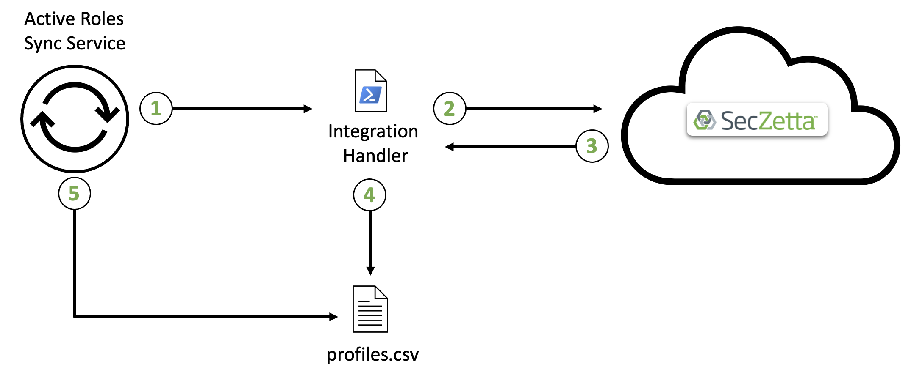

# SecZetta / Active Roles Integration

## Contents

## Overview

Oftentimes customers have the need to do some very basic automated account creation for their non-employees. SecZetta has partnered with OneIdentity's Active Roles product to do just that. This is by no means a direct replacement for a more robust IAM system as there is a very specific set of use cases this integration looks to solve. This integration essentially allows customers to 'sync' profiles to Active Directory (thereby automatically creating accounts for new profiles and removing accounts for terminated profiles). Active Roles is laser focused on the Microsoft directory stack. So on-prem Active Directory and Azure Active Directory are going to be the systems that this integration is designed to work with.

Active Roles allows customers to 'extend and enhance native capabilities of Active Directory and Azure Active Directory with One Identity Active Roles. Accelerate account, group and directory management and eliminate manual processes to increase efficiency and security. Focus on other IT tasks knowing your critical data, user permissions and privileged access are under control.'

### Architecture Overview

- Step 1: A profile was created in the SecZetta repository
- Step 2: The Active Roles synchronization service runs its sync task to pull in any newly created/updated/deleted profiles. It does this by calling the `/profiles` endpoint to query for those changes
- Step 3: The sync service analyzes any changes and sends off any and all changes to Active Roles to handle
- Step 4: Active Roles pushes the profile data to the proper OU in the proper directory (Azure AD or AD)

## Supported Features

- Sync SecZetta profile data to Microsoft Directories

## Prerequisites

1. An active SecZetta account and tenant where you have administrative privileges. To set up a new SecZetta account, please reach out to [SecZetta Support (info@seczetta.com)](mailto:info@seczetta.com)

2. An active SecZetta API Token

3. The People Profile Type ID

4. Installed Active Roles environment.

5. Active Roles synchronization service running

6. Active Directory / Azure connection setup in Active Roles

> The SecZetta Instance URL will be in this format: `https://<seczetta-tenant>.mynonemployee.com`.

> Example SecZetta API Token: `c7aef210f92142188032f5a7b59ed0f6`

> Example Vendor Profile Type ID: `47826aa2-ada3-4077-82ac-e90b4a8ce910`

## Configuration

The integration with Active Roles relys on the Synchronization Service. This service takes two different sources and makes sure they are constantly in sync. For the majority of our use cases, data will only be flowing in one direction (SecZetta => Active Roles); however, Active Roles does have the ability to start pushing back data to SecZetta.

The steps to configure the synchronzation service are explained in detail in the sections below. At a high level, here is what is required:

- Build two (2) `Connections`. One to SecZetta and the other to Active Roles
- Configure the `Mappings` so that the sync service knows how to link profiles to accounts
- Set up `Sync Workflows` with all the proper steps
  - Typically there will be three (3) steps in this workflow (Creates, Updates, Deletes)

### Connections

The Sync Service `Connection` to SecZetta is just through a csv file with all the profile data in it. This csv is actually created during the first Sync Workflow step via and `integration` handler

> Note: You will need to run the integration handler script manually the first time so that the file gets created before you are able to build this connection

The other Connection you will need to build is the one to Active Roles itself. This is a standard connector that the Sync Service provides.

### Mappings

Mappings provide the Sync Service a way to link SecZetta profiles to Active Role accounts. Typically this is done using some sort of UID. the profile `id` could likely be used as this will never change for the lifetime of non-employee.

### Sync Workflow 

This is where all the action happens. This Sync Workflow can be scheduled to run however often it needs to in order to keep the accounts up to date.

The important part of the Sync Workflow is to ensure that the first step in the workflow is to run the `Integration Handler` that grabs all of the profiles in SecZetta's repository. The diagram below shows a how this communication occurs

1. Sync Service calls an Integration Handler (Powershell Script)
2. Integration Handler runs and calls out to SecZetta using the `/profiles` API endpoint
3. SecZetta responsds back with all of the profiles in the repository
4. Integration Handler processes the response and writes all the profile data to a CSV
5. Active Roles sync service reads this CSV to begin the syncronization

> An example integration handler script is in the repo above called `example-integration-handler.ps1`. 