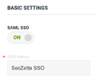

# Tutorial: Azure Active Directory SSO integration with SecZetta Identity Suite 

In this tutorial, you'll learn how to integrate SecZetta Identity Suite with Azure Active Directory (Azure AD). 
When you integrate SecZetta Identity Suite with Azure AD, you can:

- Control in Azure AD who has access to the SecZetta solutions.
- Enable your users to be automatically signed-in to the SecZetta Identity Suite with their Azure AD accounts.
- Manage your accounts in one central location - the Azure portal.

The SecZetta Identity Suite consists of various products. The SSO integrations discussed in this tutorial are focused on:

- SecZetta Life Cycle
- SecZetta Collaboration

In general the setup is similar, but there are some minor differences.

## Prerequisites
To get started, you need the following items:

- An Azure AD subscription and administrative access.
- SecZetta Identity Suite administrative access to configure SSO.
- All of your SecZetta Identity Users will need an account in Azure Active Directory, with exactly the same email address.

## Scenario description
In this tutorial, you configure and test Azure AD SSO in a test environment.

1. SecZetta Identity Suite supports SP and IDP initiated SSO for both the Life Cycle and Collaboration products.

2. SeZetta Life Cycle supports SAML JIT (Just In Time) provisioning.

## Add SecZetta from the gallery
To configure the integration of SecZetta Identity Suite into Azure AD, you need to add SecZetta from the gallery to your list of managed SaaS apps.

1. Sign in to the Azure portal using either a work or school account, or a personal Microsoft account.

2. On the left navigation pane, select the **Azure Active Directory** service.

3. Navigate to **Enterprise Applications** and then select **All Applications**.

4. To add new application, select **New application**.

5. In the Add from the gallery section, type **SecZetta** in the search box.

6. Select **SecZetta** from results panel and then add the app. Wait a few seconds while the app is added to your tenant.

## Configure and test Azure AD SSO for SecZetta Identity Suite

Configure and test Azure AD SSO with SecZetta using a test user called B.Simon For SSO to work, you need to establish a relationship between an Azure AD user and the related user in SecZetta Life Cycle or Collaboration.
To configure and test Azure AD SSO with SecZetta, perform the following steps:

- [Configure Azure AD SSO](#Configure-Azure-AD-SSO) - to enable your users to use this feature.
  - [Create an Azure AD test user](#Create-an-Azure-AD-test-user) - to test Azure AD single sign-on with B.Simon.
  - [Assign the Azure AD test user](#Assign-the-Azure-AD-test-user) - to enable B.Simon to use Azure AD single sign-on.
- [Configure SecZetta SSO](#Configure-SecZetta-SSO) - to configure the single sign-on settings on application side.
  - [Create SecZetta test user](#Create-SecZetta-test-user) - to have a counterpart of B.Simon in SecZetta that is linked to the Azure AD representation of user.
- [Test SSO](#Test-SSO) - to verify whether the configuration works.

### Configure Azure AD SSO

Follow these steps to enable Azure AD SSO in the Azure portal.

- In the Azure portal, on the SecZetta application integration page, find the **Manage** section and select **single sign-on**.

- On the Select a single sign-on method page, select **SAML**.

- On the Set up single sign-on with SAML page, click the **pencil icon** for Basic SAML Configuration to edit the settings.

- On the Basic SAML Configuration section, if you wish to configure the application in IDP and SP initiated mode, perform the following step:
  - In the Reply URL text box, type a URL using the following pattern:
  
  - For SecZetta Life Cycle use: `https://<customer>.nonemployee.com/saml/consume`
  
  - For SecZetta Collaboration use: https://<customer>.mynonemployeeportal.com /saml/consume?portal_url=portalname`
  > Note: The portal name is the name configured for the respective collaboration portal in the SecZetta Collaboration administrative interface.

- The SecZetta application expects the SAML assertions in a specific format, which requires you to add custom attribute mappings to your SAML token attributes configuration to match the SecZetta configuration for the expected attributes. 
  -The following screenshot shows the list of configured attributes aligned with the configuration in SecZetta:

- On the Setup single sign-on with SAML page, in the Federation Metadata XML section and select Download to download the XML metadata file and save it on your computer.

- In the Setup SecZetta section, we use the XML metadata file to configure SSO for SecZetta.

#### Create an Azure AD test user

In this section, you'll create a test user in the Azure portal called B.Simon.

- From the left pane in the Azure portal, select **Azure Active Directory**, select **Users**, and then select **All users**.

- Select **New user** at the top of the screen.

- In the User properties, follow these steps:
  - In the Name field, enter B.Simon.
  - In the User name field, enter the username@companydomain.extension. For example, B.Simon@contoso.com.
  - Select the Show password check box, and then write down the value that's displayed in the Password box.
  - Click Create.

#### Assign the Azure AD test user

In this section, you'll enable B.Simon to use Azure single sign-on by granting access to the SecZetta LifeCycle or Collaboration application.

- In the Azure portal, select **Enterprise Applications**, and then select **All applications**.

- In the applications list, select **SecZetta**.

- In the app's overview page, find the **Manage** section and select **Users and groups**.

- Select **Add user**, then select **Users and groups** in the Add Assignment dialog.

- In the Users and groups dialog, select **B.Simon** from the Users list, then click the **Select** button at the bottom of the screen.

- In the Add Assignment dialog, click the **Assign** button.

### Configure SecZetta SSO

The SSO configuration for the SecZetta products has small differences from a configuration perspective and the differences are indicated in this section.

To configure SSO for SecZetta we need the XML metadata file we downloaded earlier to make the SSO configuration simpler.

To configure SSO we recommended using two different browsers, so that in case of an SSO error, you have a chance to correct the error or disable SSO without locking yourself out.

### SSO Configuration for SecZetta Life Cycle

Login into your SecZetta Identity Suite environment as an administrator take the following steps:

- Select the **System** section

- Select **authentication**

- Select the **SSO** section to configure SSO:
  - Toggle the SSO switch to **ON**
  
  - Enter an SSO Name   
  
  - Enter the SP Entity ID - The value corresponds to the Azure AD SSO Identifier configuration definition for the SecZetta Life Cycle application.
  
  - Enter the Name Attribute - The value corresponds to the Azure AD name Claim configuration in the Azure AD SSO definition for the SecZetta Life Cycle application.
  
  - Enter the Email Attribute - The value corresponds to the Azure AD email Claim configuration in the Azure AD SSO definition for the SecZetta Life Cycle application.
  
  - Enter the Groups Attribute - The value corresponds to the Azure AD email Claim configuration in the Azure AD SSO definition for the SecZetta Life Cycle application.
  
  - See below an example configuration of the various attributes

  - Next we import the XML metadata we downloaded previously using the **Import File** option, so the IDP settings are automatically configured, as shown below:

  - Next select the **SAVE** button to save the SSO configuration.

### Create a SecZetta Life Cycle User

To create a user for SecZetta Life Cycle you can use the SecZetta Create User API.
You can use tools like POSTMAN to call the Create User API. For more details on using the Create User API, open the link to your SecZetta API documentation located at: https://<your domain>.mynonemployee.com/api/v1/neprofile.html#creating-a-user.

### Test SSO for SecZetta Life Cycle
In this section, you test your Azure AD single sign-on configuration with following options:

- Service Provider (SP) Initiated SSO.

  - Once SSO is enabled for SecZetta Life Cycle, a new button on the login screen appears with the name you assigned in the SSO configuration, as shown below:

  - Select the new button to test the SSO configuration and see if you can successfully login with SP initiated SSO with a user that is assigned the application in Azure AD.

- Identity Provider (IDP) Initiated SSO.
  - As Azure AD is the Identity Provider here, you can either test the SSO configuration from the application SSO configuration screen, selecting the Test button, as shown below.

  - Ensure that the logged in user to the Azure Portal has indeed access to the SecZetta Life Cycle application in Azure AD. 
  
  - Alternatively the user can login to https://myapplications.microsoft.com and select the SecZetta Life Cycle application to initiate the IDP SSO login.

### SSO Configuration for SecZetta Collaboration

Login into your SecZetta environment as an administrator take the following steps:

- Select the **Collaboration** section and from this section select **portals**:

- Select the portal from the list you want to configure SSO for or add a new portal.

- Select the **SSO** section to configure SSO:

  - Toggle the SSO switch to **ON**
  - Enter an SSO Name
  - Enter the SP Entity ID
    - The value corresponds to the Azure AD SSO Identifier configuration definition for the SecZetta Collaboration application.

  - Enter the Name Attribute
    - The value corresponds to the Azure AD name Claim configuration in the Azure AD SSO definition for the SecZetta Collaboration application.
  - Enter the Email Attribute
    - The value corresponds to the Azure AD email Claim configuration in the Azure AD SSO definition for the SecZetta Collaboration application.
  - Enter the Groups Attribute
    - The value corresponds to the Azure AD email Claim configuration in the Azure AD SSO definition for the SecZetta Collaboration application.
      - See below an example configuration of the various attributes.

 

  - Next we import the XML metadata we downloaded previously using the **Import File** option, so the IDP settings are automatically configured, as shown below:

 

  - Next select the **SAVE** button to save the SSO configuration.

### Create a SecZetta Collaboration User

To create a user for SecZetta Collaboration you can use the following methods:

- Use the Collaboration Account action in a Portal Registration workflow to create the new portal user.

- Use the SecZetta Create User API.
  - You can use tools like POSTMAN to call the Create User API. 
  - For more details on using the Create User API, open the link to your SecZetta API documentation located at: `https://<your domain>.mynonemployee.com/api/v1/neprofile.html#creating-a-user`.

### Test SSO for SecZetta Collaboration

In this section, you test your Azure AD single sign-on configuration with following options:

- Service Provider (SP) Initiated SSO.

  - Once SSO is enabled for SecZetta Collaboration, a new button on the login screen appears with the name you assigned in the SSO configuration, as shown below:

  - Select the new button to test the SSO configuration and see if you can successfully login with SP initiated SSO with a user that is assigned the application in Azure AD.
  
- Identity Provider (IDP) Initiated SSO.

  - As Azure AD is the Identity Provider here, you can either test the SSO configuration from the application SSO configuration screen, selecting the Test button, as shown below.

  - Ensure that the logged in user to the Azure Portal has indeed access to the SecZetta Collaboration application in Azure AD.
  
  - Alternatively the user can login to https://myapplications.microsoft.com and select the SecZetta Collaboration application to initiate the IDP SSO login.