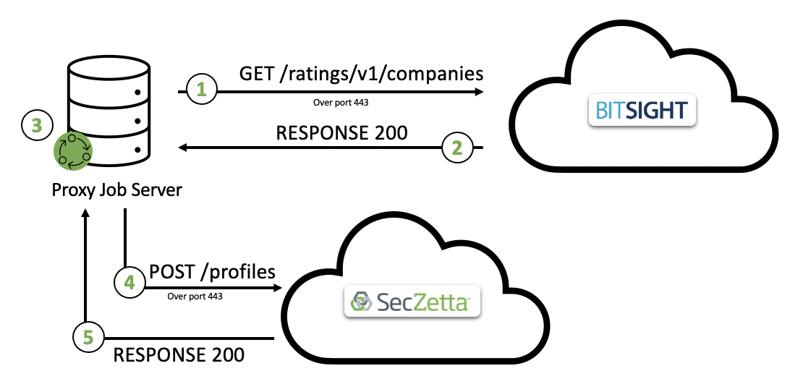
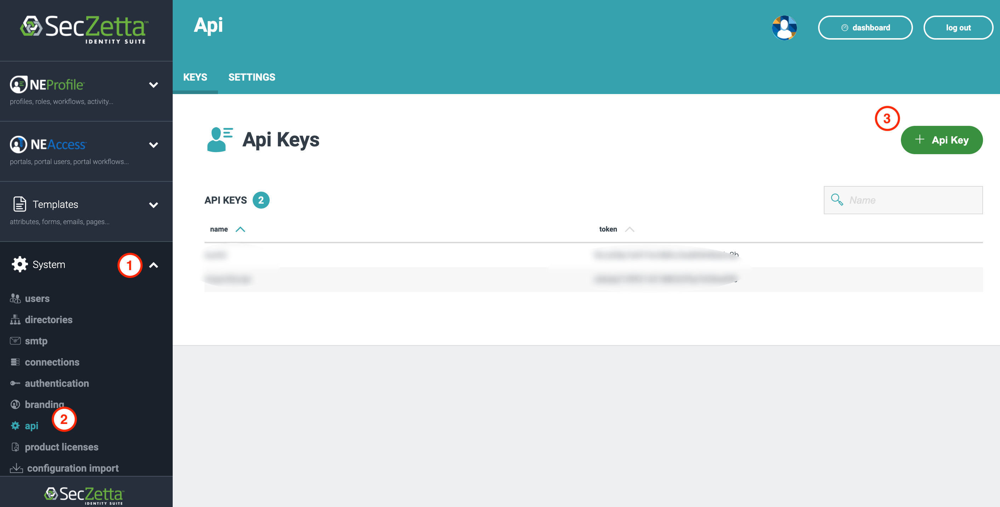

# SecZetta / BitSight Integration

## TOC 

- [SecZetta / BitSight Integration](#seczetta---bitsight-integration)
  - [Overview](#overview)
  - [Supported Features](#supported-features)
  - [Prerequisites](#prerequisites)
    - [Examples](#examples)
  - [Configuration](#configuration)
    - [SecZetta Config](#seczetta-config)
    - [BitSight Config](#bitsight-config)

<small><i><a href='http://ecotrust-canada.github.io/markdown-toc/'>Table of contents generated with markdown-toc</a></i></small>

## Overview

Organizations are often in the dark when it comes to understanding the actual security performance of critical third parties or even assessing the impact of their own security programs and policies. This is due to a lack of objective metrics and tools that help measure and mitigate cyber risk across the business ecosystem.

BitSight pioneered the security ratings market, founding the company with a solitary mission: to transform how organizations evaluate risk and security performance by employing the outside-in model used by credit rating agencies.

SecZetta is able to utilize this robust cyber risk data to apply directly to not only organizations but to apply that risk to the underlying identities associated with those organizations. This allows our customers to use this risk data inside SecZetta workflows and also passed down to our other partner integrations (IAM / PAM)

The below diagram gives a high level architecture diagram

### Architecture Overview

- Step 1: Call BitSight to grab all companies risk ratings
- Step 2: BitSight responds back with the risk ratings
- Step 3: Proxy Job server analyzes risk rating and normalizes risk score to pass to SecZetta
- Step 4: Proxy Job server pushes risk data to Vendor profiles
- Step 5: Success response sent back

## Supported Features

- Sync BitSight risk rating to SecZetta 

## Prerequisites

1. An active SecZetta account and tenant where you have administrative privileges. To set up a new SecZetta account, please reach out to [SecZetta Support (info@seczetta.com)](mailto:info@seczetta.com)

2. An active SecZetta API Token

3. The Vendor/Org Profile Type ID

4. BitSight Environment with administrative access

5. BitSight Token (to use the API)

<small><i>See [Configuration](#configuration) for more details</i></small>

### Examples

> The SecZetta Instance URL will be in this format: `https://<seczetta-tenant>.mynonemployee.com`.

> Example SecZetta API Token: `c7aef210f92142188032f5a7b59ed0f6`

> Example Vendor Profile Type ID: `47826aa2-ada3-4077-82ac-e90b4a8ce910`

> Example BitSight token: `d24b46958ece37895493f3811422569a61196760`

## Configuration

As described above in the high level [architecture](#architecture-overview), the BitSight integration runs on the Proxy Job Server. The script [sync-bitsight-risk-ratings.rb](sync-bitsight-risk-ratings.rb) is a RUBY script that will be scheduled to keep SecZetta up to date. The configuration itself is mostly about the set up of the prerequisites.

### SecZetta Config

#### Generating a SecZetta API Key

In order to generate an API Key follow these steps: 

1. Navigate to the [admin](#seczetta-admin-dashboard) side of SecZetta (NEProfile dashboard). 

2. Click into [`System -> api`](#seczetta-api-page)

3. Click the `+ Api Key` button and copy your API Key

#### SecZetta Admin Dashboard

#### SecZetta API Page

### BitSight Config
