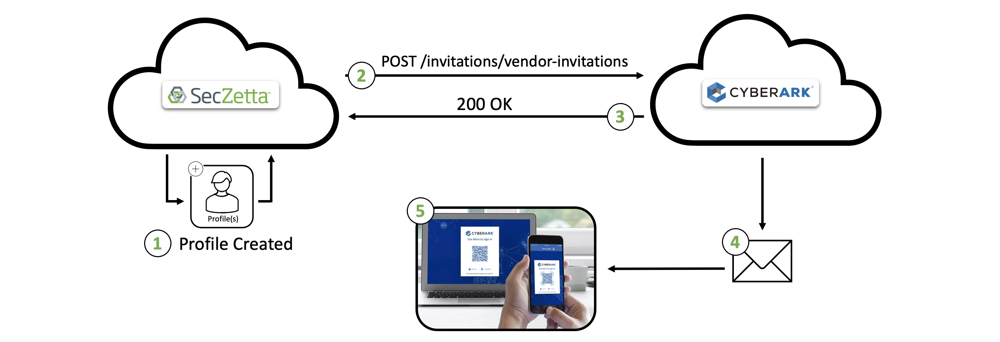

# SecZetta / Cyberark Alero Integration

## Contents

<small><i><a href='http://ecotrust-canada.github.io/markdown-toc/'>Table of contents generated with markdown-toc</a></i></small>

## Overview

CyberArk Remote Access (formerly Alero™) combines Zero Trust access, biometric multi-factor authentication and just-in-time provisioning into one SaaS-based offering. Remote Access is designed to provide fast, easy and secure privileged access to 3rd party vendors who need access to critical internal systems via CyberArk, without the need to use passwords. By not requiring VPNs or agents Remote Access removes operational overhead for administrators, makes it easier and quicker to deploy and improves organizational security.

SecZetta's integration into Cyberark Remote Access is focused on the onboarding / offboarding of all non-employees that SecZetta is managing. The SecZetta onboarding process can be minimally changed to add extra steps to automatically send out CyberArk Remote Access invitiations. This will ensure your vendors have the ability to securely RDP into the proper environment securely.

### High Level Diagram

- Step 1: Approved Non-employee is created inside SecZetta
- Step 2: SecZetta communicates with CyberArk to send off invitation to this newly created non-employee
- Step 3: CyberArk responds back with a 200 OK Success message
- Step 4: CyberArk sends out email/phone notification to non-employee
- Step 5: Non-employee registers his/her CyberArk Remote Access account and is able to start work

## Supported Features

- Automatically trigger CyberArk Remote Access email notifications
- Disable outstanding invitations on offboarding
- Disable CyberArk Remote Access account (if required) during offboarding

## Prerequisites

1. An active SecZetta account and tenant where you have administrative privileges. To set up a new SecZetta account, please reach out to [SecZetta Support (info@seczetta.com)](mailto:info@seczetta.com)

2. An active SecZetta API Token

3. Any other prereqs

4. CyberArk Remote Access service account and private key (for calling the CyberArk API)

> See CyberArk's API Documentation Here: https://api.alero.io/swagger-ui.html#/

### Examples

> The SecZetta Instance URL will be in this format: `https://<seczetta-tenant>.mynonemployee.com`.

> Example SecZetta API Token: `c7aef210f92142188032f5a7b59ed0f6`

## Configuration

The configuration on the SecZetta side is all inside workflows using the REST API action. CyberArk has an api endpoint for sending out vendor invites and managing those invites after the fact (e.g. `https://api.alero.io/v1-edge/invitations/vendor-invitations`)

For documentation purposes no approvals or extra SecZetta workflows will be shown, but understand that all of these extra features can be layered on top of this integration.

There is also a powerpoint script that CyberArk provides its partners/customers that might be useful for those who want to dig deeper into the technical side of the integration. See that script in the repo [here](alero-helper.ps1)

### Creating the REST API Action

For CyberArk, the `OAuth2 w/private key jwt` authentication option will be used to call the API endpoint. Assuming you have the required pre-requisites, the configuration is very simple.

#### Authentication Example Values

| Attribute        | Value |
|------------------|-------|
| Auth Type        | OAuth2 w/private key jwt |
| Access token url | https://auth.alero.io/auth/realms/serviceaccounts/protocol/openid-connect/token |
| Private key      | <Private Key Redacted> |
| Encryption type  | RS256 |
| Iss              | 11eaab2250acefe0b97f95ccc5c5e407.11eb25ce2fcb389daba55df479a966a3.ExternalServiceAccount |
| Sub              | 11eaab2250acefe0b97f95ccc5c5e407.11eb25ce2fcb389daba55df479a966a3.ExternalServiceAccount |
| Aud              | https://auth.alero.io/auth/realms/serviceaccounts |