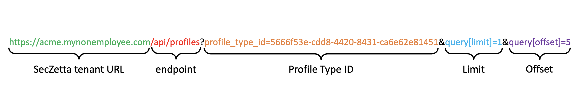

# IAM Integration

## Overview

At the highest of levels, SecZetta can be considered your authoritative source for all non-employee user types. This includes but is not limited to: Contractors, Consultants, 3rd party vendors, Students, Alumni, Doctors, Affiliates and the list can go on and on. SecZetta is **not** a provisioning solution and it relys on its top Identity partners to handle this for our joint customers. Because of this, SecZetta has built certified integrations with many of the top Identity and Access Management (IAM) tools in the market. This guide is not going to go into specifics about particular IAM vendors, but rather discuss the best practices approach on how we integrate with any and all IAM systems.

SecZetta has a robust workflow and collaboration engine that allows our customers to automate complex business processes without the use of complex code. Regardless, at the end of the day SecZetta will be managing various types of `Profile Types`. These Profile Types can be any type of object that a customer may need to manage. The primary ones that an IAM tool will care about is the `People` profile type and potentially the `Assignments` profile type. These profile types will be discussed in detail below. Each profile type will have many different types of profiles and these profiles are going to be what your IAM system cares most about.

There are *primarily* 2 ways our customers integrate with their IAM solutions depending on the capabilities of the IAM tool. The rest of this guide will discuss and expand upon these 2 integration approaches.

### 1. IAM initated data aggregation

This integration is initiated from the IAM system itself. These solutions sometimes call this data aggregations, data collection, or something similar. All of your IAM tools will have some sort of connector framework that will allow data to flow from an external place into the IAM system itself.

Within this integration type there is also 2 ways to go about it. There is a flat file based integration and there is API based integration.

#### Flat File Integration

For this integration the IAM tool simply looks for a file with a specific format in a specific location and pulls all data into the IAM solutions internal database. This integration 'sub-type' is the easiest way to integrate your IAM system with SecZetta.

Common type of file formats are CSV, JSON, and maybe something like XML. CSV being the overwellmingly most popular of the three. Every IAM solution will be able to handle this type of integration. We will assume CSV for the remainder of this documentation

The data in this CSV file will contain all the relavant Identity data to allow the IAM system to properly manage the lifecycle of that user. Things like *firstname*, *lastname*, status, *start date*, *end date* and much, much more will be included in this file.

##### Example CSV (in table form)

| profile_uid | first_name | last_name | status     | start_date |  end_date  |termination_date|
|-------------|------------|-----------|------------|------------|------------|----------------|
| 00000456    | Martha     | Walker    | Active     | 01/01/2001 | 01/01/2030 |                |
| 00000457    | Felicia    | Lucas     | Terminated | 01/02/2001 | 01/01/2020 | 01/01/2020     |
| 00000458    | Brianna    | Bennett   | Active     | 01/01/2001 | 01/01/2030 |                |
| 00000459    | Adrian     | Ryan      | Active     | 01/01/2001 | 01/01/2030 |                |

> Note: A production CSV will have many more fields compared to the example above

#### API Integration

This integration is a much more modern type of integration. In this case, the IAM system has to have a generic REST API connector (*sometimes referred to as a Web Services connector*). SecZetta has a robust API framework that allows IAM systems to easily pull any and all profile data from the SecZetta solution.

### 2. SecZetta-initiated integration

In this type of integration, SecZetta will trigger the updates to the IAM system via RESTful api call. The obvious pre-requisite is that the IAM system has an API framework that is excessible to SecZetta. Knowing that SecZetta is a SaaS solution running in the public cloud this type of integration could be a potential challange for any of those IAM systems that are running on-prem behind the customer's firewall.

More often than not, this type of integration is only really used when the IAM system in question is also a SaaS solution running in the public cloud. This way firewalls are not an issue and everything can commuicate securely without having to poke holes in a customer's  firewall.

## Using SecZetta's API

See the [integrations overview](../README.md#using-seczettas-api) for specifics on how to being using the API. This will explain how to generate an API Key, use that key for authentication, and walking thru a basic RESTful request.

For IAM integrations focus will be placed on a specific API endpoint. (the `/profile` endpoint). There are other useful endpoints that may be expanded on further in the document but for now, the `/profile` endpoint will suffice.

> Please Note:  
> for the rest of the document `https://acme.mynonemployee.com` will be used as the SecZetta tenant URL.

### Getting Profiles

The `/profiles` endpoint is the simplest way to grab profile data out of the SecZetta solution. This endpoint allows you to pull all profiles belonging to a specific profile type. This request allows for the paging as well to handle large datasets.

As you can see from above the request url is broken up into 5 different parts.

| ID | URL Section         | Variable        | Description |
|----|---------------------|-----------------|-------------|
| 1  | SecZetta Tenant URL | N/A             | The tenant URL (in our case acme.mynonemployee.com)
| 2 | endpoint             | N/A             | Use the `/profile` endpoint
| 3 | Profile Type ID      | profile_type_id |This is how the request knows which profiles to return
| 4 | Limit                | query[limit]    |This tells the request how many profiles to return per call
| 5 | Offset               | query[offset]   |This tels the request what page of the results you want to return back. Starting at `0`

The first 2 parts of the endpoint are straightforward and won't need to change. The next 3 are what will determine the type and quantity of the profiles returned. 

#### How to get your Profile Type ID?

The easiest way to grab your Profile Type ID is to head to the Profile Types page in the admin console of SecZetta

**https<i></i>://acme.mynonemployee.com/neprofile_admin/profile_types**

> Change `acme` to the tenant name given to you by SecZetta support

From there Click the profile type that is needed and when that page loads the profile type ID is in the url itself. The url should look something like this:

https<i></i>://acme.mynonemployee.com/neprofile_admin/profile_types/`5666f53e-cdd8-4420-8431-ca6e62e81451`/basic_settings

#### What's up with Limit and Offset?!

The limit and Offset variables in the /profiles request control how many and what page of profile data you get back. Let's break down the two variables invividually 

##### Limit

Limit allows the request to retrieve only the specified number of profiles before returning. The limit is set by using the `query[limit]` variable. By default, the request will try to return all available profiles and can result in a timeout issue (SecZetta's default API timeout is `60 seconds`). To avoid this issue make sure the limit variable is set to something managable, `100` is a good starting point

##### Offset

Offset tells the request what page to retrieve based on the limit specified. Let's do a fictional example:

* There are 1027 `People` profiles in SecZetta.
* The `query[limit]` used is `100`

In this example there will be **11** calls. The calls themselves are broken down below.

| Call # | Profiles Returned | Indexes Returned |
|--------|-------------------|------------------|
| 1      | 100               | 1 - 100          |
| 2      | 100               | 101 - 200        |
| 3      | 100               | 201 - 200        |
| 4      | 100               | 301 - 200        |
| 5      | 100               | 401 - 200        |
| 6      | 100               | 501 - 200        |
| 7      | 100               | 601 - 200        |
| 8      | 100               | 701 - 200        |
| 9      | 100               | 801 - 200        |
| 10     | 100               | 901 - 200        |
| 11     | 27                | 1001 - 1027      |

