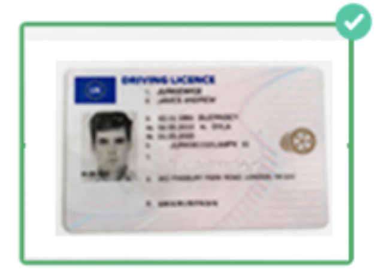
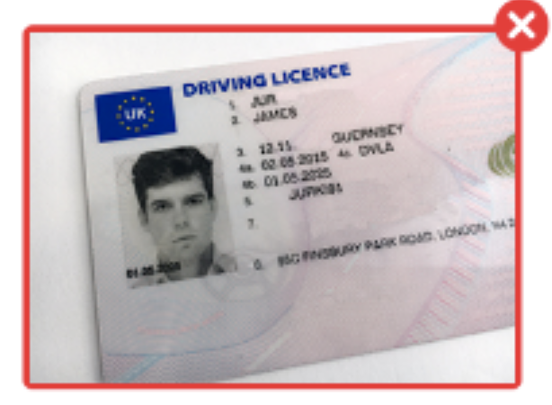
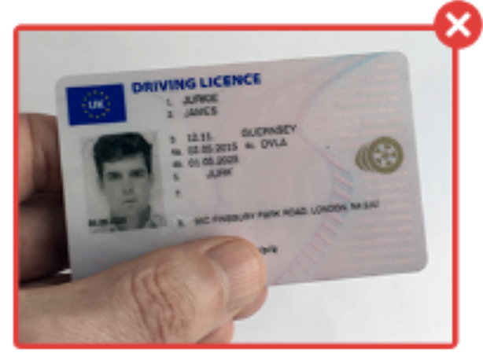
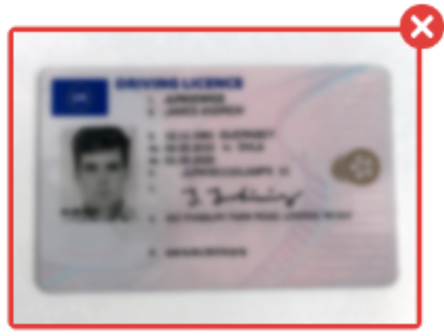
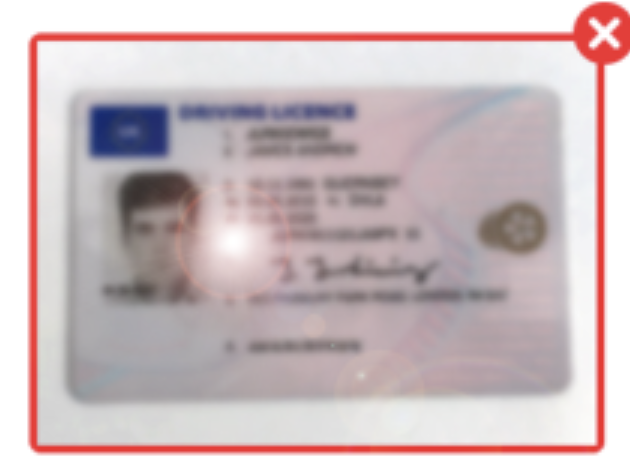

# Self Service Identity Verification Guidance

## Verifying Your Identity

Our system uses an automated identity verification technology to ensure you are who you claim to be.  This is done in two steps:

* Capturing images of your Government issued ID
* Capturing an image of yourself

When capturing images of your government issued ID and yourself, it is important to get clear and high-quality pictures. The capture process will guide you in real time on how to capture your images, but here are some useful tips and tricks.

## Government Issued ID Image Capture

To confirm your identity, you will first capture images of your government issued ID. Our system will use Artificial Intelligence and Computer Vision to authenticate your document, ensuring that it is legitimate and not tampered with. To get the best results, please follow the guidelines below. 

### Recommended Process

1. Lay your government issued ID on a flat surface.
2. Follow the onscreen directions to capture your images.
3. Hold your camera 4 to 6 inches straight over your document.
4. Use the following guidelines for best results:

### <h3 align="center">Acceptable Image</h3>

Entire image captured, with all 4 corners, nothing blocking the image, no blur, and no glare.

    

### <h3 align="center">Must show all four corners of card</h3>
 Ensure the full document is in the frame – extra background is fine, as long as you get all 4 corners.

    

### <h3 align="center">Must not be covered in any way</h3>

Ensure there is nothing obstructing the image. Avoid holding in your hands for this reason.

    

### <h3 align="center">Must not be blurry</h3>

Do not move the camera while taking the picture. Consider cleaning your phone’s camera lens with your shirt before capture.

    

### <h3 align="center">Must not have glare from direct light</h3> 

Avoid using a flash when capturing the image. Avoid harsh overhead lights – natural light is best.

    

### Selfie Tips

* Remove your mask, glasses and hat.
* Hold your camera 7 to 10 inches straight out from your face.
* Hold the camera steady to avoid blur.
* Avoid sharp light on your face–natural light is best.
* Ensure your face takes up the majority of the photo.
