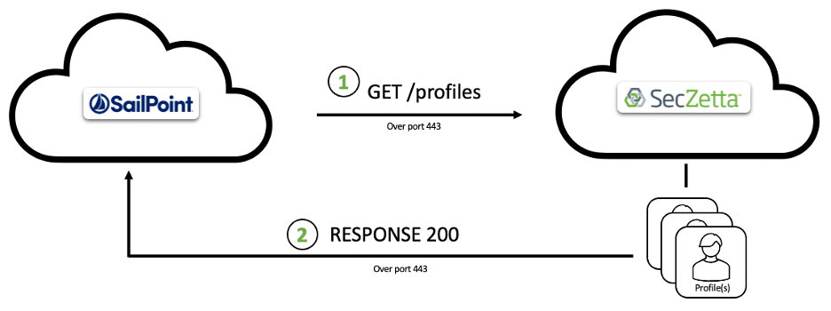

# SecZetta / SailPoint IdentityIQ Integration

## Overview

The integration between SecZetta and SailPoint IdentityIQ (IIQ) allows IIQ to pull profile information from SecZetta through a web-services read-only connector in IIQ.

## Support Features

The SecZetta/IIQ integration is based on the IIQ webservices connector and utilizes the SecZetta REST apis.

* Test Connection
  * Validates connectivity to the SecZetta tenant
* Account Aggregation
  * IIQ Web Services connector to read profile information based on assignment/population
  * Pagable calls to read assignment profiles, with secondary api calls to read person information
* Get Object
  * Supports fetching a single record
  
## High Level Connector Architecture



## Identity <-> Profile Management Approaches

The SecZetta/IIQ integration can be configured in a number of different ways depending on the business needs to manage the non-employee data.  The same connector is utilized for both profile management approaches, with the differences handled by IIQ creation & correlation rules and identity attribute mappings.

* Person based management
  * This configuration has each person profile in SecZetta represented as a seaparate identity in IIQ.  Each assignment for the person is represented as a separate account for the person.
  * Allows for management of a person, but handle access based on the assignments a person has, either through separate accounts, or separate access.
  * This configuration requires decisions to be made regarding which sponsor is assigned as a person's manager in IIQ in the identity attribute logic in IIQ.
  
* Assignment based management
  * This configuration has each assignment profile in SecZetta represented as a separate identity in IIQ.  If a person has multiple assignments, each assignment would be it's own identity cube.
  * Allows for complete separation of access for each assignment, including separate managers and accounts.

## Artifacts

There are four SailPoint IdentityIQ artifacts for this integration.
1. Application-SecZetta Proviers.xml
2. Application-SecZetta Students.xml
3. CorrelationConfig-SecZettaPersonIDCorrelation.xml
4. Rule-SecZettaCreateRule.xml

There is one SecZetta configuration that needs to be imported and then calls added to workflows.
1. seczetta-sync_attr_assignments-import.json

## Pre-Reqs

### API Token

An API token needs to be created in SecZetta for use by the SailPoint IdentityIQ connector.  It is recommended that each connector or interface into SecZetta uses it's own API token to allow for easier change tracking and future updating.

To generate a new token in SecZetta, navigate to the Admin pages, select 'System', then 'API'.   Then select *+Api Key* to create a new key.  For tracking, name the key after the connector.   For this baseline configuration there will be 2 connectors, therefore two api keys should be created *IIQ Students* and *IIQ Providers*.

### SecZetta's Assignment Profile ID

The assignment profile id will be needed to configure the IdentityIQ connector.  The assignment profile id can be retrieved by calling the SecZetta api GET:/profile_types?name=Assignments. The 'id' attribute is what should be used in the connector's application configuration attribute *SECZZETTA_assignment_profile_type_id*.

```json
{
    "profile_types": [
        {
            "id": "be130e38-73a5-45f3-91f4-a5180c5cb7aa",
            "uid": "assignments_profile_type",
            "name": "Assignments",
            "bypass_dup_protection": false,
            "archived": false,
            "permitted_role_ids": [
                "012561d0-eaab-4af6-a15b-48cd5fadb1f2",
                "043f9fba-d584-48de-863f-f25709e43c01",
                "053bfdd4-3a2a-4227-b0ca-684c34f486e8",
                "0f423a9b-b052-4f1d-984d-6bc22a504423",
                "12a72ee0-6772-43e4-9942-59312d50d443",
                "27f46dcc-265c-414a-9b05-55a9a69d49ae",
                "56ead39e-ea94-4e04-8215-6205627203ef",
                "644e8363-d0ca-4d40-805c-936256470a24",
                "70e2757a-ece5-4166-b980-200f350ec4a6",
                "a3d3e935-0cb4-4f67-96ee-493500943628",
                "a57615c0-30f0-49c8-831a-43dc4ffaf128",
                "a68f5d1a-c0d4-421e-bbbd-0132bb86dc8a",
                "a94d2f9b-0a88-4a94-888b-8894b7cf3ea4",
                "ab1d468e-a0aa-426d-81de-7be1e51ddbf2",
                "bfa7243e-a76a-4046-9434-da1ff5132878",
                "d02e69bf-e22d-4a65-8012-3a7fbb534d38",
                "e3204ed5-2189-44c4-8f65-f167085062cd"
            ],
            "profile_type_dup_attributes": [],
            "profile_type_namings": [
                {
                    "id": "1242a6e4-89e6-4709-b5ad-111bb780f40e",
                    "uid": "aac956ac73244ac08bf419677c185b04",
                    "profile_type_id": "be130e38-73a5-45f3-91f4-a5180c5cb7aa",
                    "ne_attribute_id": "bb51e30b-26ac-4e81-a6ee-3d05b2883afa",
                    "order": 1
                },
                {
                    "id": "184f2076-e34e-4a7d-9049-04d1a0a84995",
                    "uid": "717da4eb02ed4abda7ebd6b26066c228",
                    "profile_type_id": "be130e38-73a5-45f3-91f4-a5180c5cb7aa",
                    "ne_attribute_id": "507a3af1-72e2-4334-bc0c-47028acdda98",
                    "order": 2
                },
                {
                    "id": "b150c432-aedf-4de2-9bbf-bb38d3b447c7",
                    "uid": "d7dc7f9c7eea4a83a463334f3a12d8cf",
                    "profile_type_id": "be130e38-73a5-45f3-91f4-a5180c5cb7aa",
                    "ne_attribute_id": "115ab8d2-deb4-47aa-af04-7bac3e39f586",
                    "order": 3
                }
            ]
        }
    ]
}
```

### SecZetta's Assignment Type Attribute ID

The assignment_type attribute id can be retrieved by calling the SecZetta api GET:/ne_attributes?label=Population. The record returned should uid=assignment_type.  Use the id value in the connector's application configuration for the attribute *SECZETTA_assignment_type_attribute_id*.

```json
{
    "ne_attributes": [
        {
            "id": "115ab8d2-deb4-47aa-af04-7bac3e39f586",
            "allow_multiple_selections": false,
            "archived": false,
            "archived_on": null,
            "created_at": "2022-04-15T08:47:06.000-04:00",
            "crypt": false,
            "date_format": null,
            "description": "",
            "filtered_by_ne_attribute": false,
            "filtering_ne_attribute_id": null,
            "label": "Population",
            "legacy_id": null,
            "ne_attribute_filter_id": null,
            "ownership_driven": false,
            "profile_type_id": "08a5f714-6603-4502-956a-ff7ae5139ee3",
            "reverse_association_attribute_id": null,
            "risk_score_setting": "standard",
            "risk_type": "none",
            "selectable_status": "Active",
            "tmp_created_at": "2022-04-15T08:47:06.761-04:00",
            "tmp_updated_at": "2022-04-15T08:47:29.364-04:00",
            "tool_tip": "This signifies the type of non-employee assignment. This type field will change how and what data is captured",
            "uid": "assignment_type",
            "updated_at": "2022-04-15T08:47:06.000-04:00"
        }
    ]
}
```

### SecZetta's Population ID

The id for this attribute can be determined by finding the specific profile for the Population that the connector should be viewing. This can be retrieved by calling the SecZetta api GET:/profiles?profile_type_id=<profile_type_id from above>&name=<population name>.  Use the id value returned in the connector's application configuration attribute *SECZETTA_POPULATION_PROFILE_ID*. The results below were retrieved by calling /profiles?profile_type_id=08a5f714-6603-4502-956a-ff7ae5139ee3&name=Provider where 'Provider' is the population this connector will view.

```json
{
    "profiles": [
        {
            "id": "1f9c83c5-d115-4fd1-940e-a6bae732cf9d",
            "uid": "9d2ddbd22bbd4666bab0695e471f8070",
            "name": "Provider",
            "profile_type_id": "08a5f714-6603-4502-956a-ff7ae5139ee3",
            "status": "Active",
            "id_proofing_status": "pending",
            "updated_at": "2022-04-15T08:47:15.000-04:00",
            "created_at": "2022-04-15T08:47:15.000-04:00",
            "attributes": {
                "allowed_organizations": "Org1, Org2, FirstOrgq, Org4 Provider, Org5",
                "display_name": "Provider"
            }
        }
    ]
}
```

## Connector Configuration

The demo connector is configured to function with the default SecZetta baseline configuration. Attribute & mappings can be added and removed as needed by the implementation.

### Connector Settings

Import the application xml and modify the following attributes to make the connection

Attribute        | Description
---------------- | -------------------
SECZETTA_authorization | This is the authorization string used in the REST APIs to SecZetta.<br>Syntax is: 'Token token=<api_from_seczetta_admin_api_page>'
SECZETTA_assignment_profile_type_id | This is the internal id value for the assignment profile type
SECZETTA_assignment_type_attribute_id | This is the internal id value for the assignment_type attribute
SECZETTA_population_profile_id | This is the internal id value for the specific population that the connector should retrieve

### Connector Operations

All connector operations have the same header parameters.

Key|Value
----|----
Authorization|\$application.SECZETTA_authorization\$
Content-Type|application/json
Accept|application/json

#### Test Connection

The test connection operation does a simple query to just call the /profile_types endpoint in SecZetta to validate connectivity. Only getting a successful status code back is needed to be successful.

Method: GET
Endpoint: /profile_types
Body:
Response Code: 200

#### Account Aggregation

There are 2 connector operations defined for Account Aggregation.   The 'Account Aggregation - Assignments' is the driving operation which pages through all assignment profiles.  The 'Account Aggregation - Person Details' is a child operation that is call for each assignment profile read in to getch the needed person attributes.

##### Account Aggregation - Assignments

The account aggregation to get assignments utilizes an advanced_search call against SecZetta.  This call will retrieve all assignment profiles with a specific population set.

```json
{
    "advanced_search": {
        "condition_rules_attributes": [
            {
                "type": "ProfileAttributeRule",
                "object_type": "NeAttribute",
                "condition_object_id": "$application.SECZETTA_assignment_type_attribute_id$",
                "comparison_operator": "include?",
                "value": "$application.SECZETTA_population_profile_id$"
            },
            {
                "type": "ProfileTypeRule",
                "comparison_operator": "==",
                "value":"$application.SECZETTA_assignment_profile_id$"
            }
        ]
    }
}
```

The query will return a response like this:
```json
{
    "profiles": [
        {
            "id": "593e5ab9-9351-4ece-88c3-1c3cdc6b3fea",
            "uid": "3a679553574940dcb3c7dbe13d2858b1",
            "name": "Jason Smith - Provider",
            "profile_type_id": "be130e38-73a5-45f3-91f4-a5180c5cb7aa",
            "status": "Active",
            "id_proofing_status": "pending",
            "updated_at": "2022-04-29T09:31:19.462-04:00",
            "created_at": "2022-04-29T09:31:18.182-04:00",
            "attributes": {
                "assignment_type": "Provider",
                "assignment_organization": "1234 ACME",
                "separator_ne_attribute": "-",
                "end_date": "04/30/2022",
                "department_ne_attribute": "Department 1",
                "assignment_id": "A000002",
                "source": "",
                "sponsor": "Mary Jenkins (mary_jenkins@acme.com)",
                "assignment_sponsor_user_id": "cge231cf-f932-7356-3ed1-2b31582c315f",
                "date_created": "04/29/2022",
                "assignment_person": "Jason Smith",
                "assignment_person_profile_id": "cce541cf-c024-4595-9ee7-1a31582a598b",
                "job_title_ne_attribute": "CEO",
                "start_date": "04/29/2022",
                "first_name": "Jason",
                "middle_name": "Martin",
                "last_name": "Smith",
                "birth_day": "11",
                "birth_month": "02",
                "eligible_for_rehire": "Yes",
                "ssn_last_4": "1234",
                "personal_phone_number": "1-555-555-1212",
                "professional_phone_number": "1-111-111-2222",
                "policy_accepted": "Yes",
                "organization_name": "ACME",
                "person_id": "P00001",
                "email": "jason.smith@acme.org"
            }
        }
    ]
}
```

#### Get Object

The get object is nearly identical to the aggregation calls, except the parent call will just retrieve the specific assignment profile, based on it's id.


### Account Schema Attributes

The connector returns all the available attributes for the assignment and people profiles.  This is the same for account aggregation and get object operations.

IIQ Schema Name | Description
---------   |   ---------
person_assignment_organization | Name of the organization assigned
person_eligible_for_rehire | is the person eligible for rehire
person_email | email address for the person
person_first_name | first name for the person
person_last_name | last name for the person
person_middle_name | middle name for the person
person_personal_phone_number | personal phone number for the person
person_professional_phone_number | work phone number for the person
person_ssn_last_4 | last 4 digits of the person's social security number
assignment_id | id value for the assignment profile
assignment_profile_type_id | id of the assignment_profile_type
assignment_assignment_id |  A# id for the assignment
assignment_assignment_organization | name of the assignment organization
assignment_person | display name for the person associated with the assignment
assignment_status | status of the assignment
assignment_sub_type | sub-population assigned to this assignment
assignment_assignment_type | the population for this assignment (Provider | Student)
assignment_date_created | date the assignment was created
assignment_department | department name for the assignment
assignment_end_date | end date provided for the assignment
assignment_job_title | job title for this person's assignment
assignment_name | display name for the assignment profile
assignment_source | method that the assignment profile was created
assignment_start_date | start date for the assignment
assignment_person_profile_id | id for the associated person profile 
assignment_sponsor_login | login for the associated sponsor user account


## SecZetta Workflow Changes

In order to support the above configuration, the workflows in SecZetta need to include the approriate steps to populate the id values for the assignment_person_profile_id and assignment_sponsor_user_id attributes along with the needed organization and person attributes.

The baseline workflows that need to be updated are (with the needed attributes to send) for all related assignments:
- Add Assignment
  - assignment_organization, assignment_person
- Update Assignment Details
  - assignment_organization, assignment_person
- Update Person Details
  - person_assignments
- New Non-Employee
  - assignment_organization, assignment_person
- Update Organization
  - organization_assignments

Each of these workflows need a final action to call the 'Synchronize Assignment Attributes' workflow.

