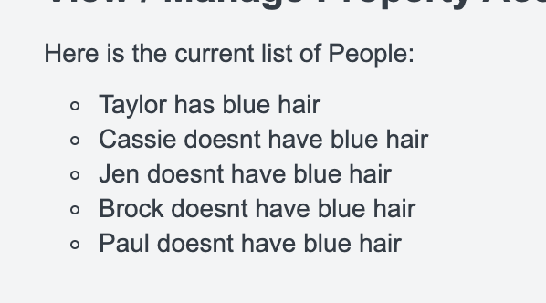

# Branding Best Practices

## Introduction

SecZetta allows you to upload a custom.css file that gets added to every page that will load within the tool. This document talks about some useful tips and tricks to utilize this custom css to its fullest

## Large Scale Dashboard Changes

There is an attached sample CSS file ([Linked Here](custom-dashboard.css)) that shows the specific selectors to be able to brand the product in its entirety. This includes Dashboard background colors, button colors, icon colors, table colors etc. The documentation below describes what classes tie to what HTML elements and how to best brand the product to meet your customer's needs

> As the product gets updated some of these selectors may become invalid. The SecZetta services team try to update and maintain this documentation to the best of its abilities

### Dashboard

Below is an image that describes the different [CSS Selector's](https://developer.mozilla.org/en-US/docs/Learn/CSS/Building_blocks/Selectors) that can be used to change the dashboard color(s). This is really just focused on the major elements like backgroud colors. The next section will talk about the buttons and tabs.


The `body` tag will let you adjust the font on pretty much all page. See the below example to change the `font-family`, `font-size`, and `font-weight`

```css
#dashboard-header {

}

body {
    font-family: Arial, sans-serif;
    font-size: 14px;
    font-weight: 100;
    color: #333d47;
}

/* Lifecycle Left Navigation Bar 
    #dashboard-nav
    #dashboard-nav #dashboard-nav-footer

*/
#dashboard-nav {
    background: black;
}
#dashboard-nav #dashboard-nav-footer {
    background: black;
}

#left-nav {
    background: black;
}

#left-nav .nav-item.open { 
    background: black;
    /*border-bottom: 1px solid white;*/
}

#dashboard-nav #user-container {
    background: none
}

#neaccess-header {
    background: black
}

#neaccess-header #company-logo-container {
    background: black
}
```

## Change a workflow button color

The buttons that execute a workflow look like this in HTML form

```html
<a data-id="d2ef758b-026e-446c-9790-f326919f2eaa" href="/neprofile_dashboard/workflows/d2ef758b-026e-446c-9790-f326919f2eaa/workflow_sessions/new?pid=d195b829-f327-4fa4-aca6-6e4af33b5b42">
    <li class="btn-request">
        <div class="icon-requests"></div>
        Terminate
    </li>
</a>
```

If you want to change the color of that button. You actually have to do it on the child `li` element with the class `btn-request`. Each workflow itself will have an `id`. That id is what is show under the `data-id` attribute on the `a` element. You can see above that the workflow in question has an id of `d2ef758b-026e-446c-9790-f326919f2eaa`. So we can use a css selector with a child element selector as shown below to change the background color of that workflow button:

```css
a[data-id="d2ef758b-026e-446c-9790-f326919f2eaa"] > li{
    background: red !important;
}
```

### Result


## Form Header in HTML Text Element

```html
<p class="margin-bottom-small pb_form_heading">Form Title</p>
<hr>
```


## Format Bullets so they look decent

For whatever reason, our HTML form element isnt really full HTML. It limits what you can do, and also strips out specific HTML elements. Here is a good starting point to get something that looks decent

```html
<p style="margin-bottom:10px;">Here is the current list of People:</p>

<ul style="list-style-type:circle;padding:0px 0px 20px 30px;">


<li style="margin:5px 0px 5px 0px;">{{person.name}} - has blue hair</li> 

<li style="margin:5px 0px 5px 0px;">{{person.name}} - doesn't have blue hair</li> 


</ul>
```

Notice the margin  on the `ul` element as well as the `li` elements.

Here is another example that you can just paste directly into your HTML form field. Got rid of the liquid fors and ifs
```html
<p style="margin-bottom:10px;">Here is the current list of People:</p>

<ul style="list-style-type:circle;padding:0px 0px 20px 30px;">
    <li style="margin:5px 0px 5px 0px;">Taylor has blue hair</li> 
    <li style="margin:5px 0px 5px 0px;">Cassie doesnt have blue hair</li> 
    <li style="margin:5px 0px 5px 0px;">Jen doesnt have blue hair</li> 
    <li style="margin:5px 0px 5px 0px;">Brock doesnt have blue hair</li> 
    <li style="margin:5px 0px 5px 0px;">Paul doesnt have blue hair</li> 
</ul>
```

### Result
Here is the result. Nothing fancy, but better than if you just did the standard HTML for `<ul>` and `<li>`



## Hide Profile Tab on dashboard

The following CSS will remove the profile tab with the given href. Notice this example will hide a profile type with id = `743f55e6-3bfc-4127-88bb-ddcdee287397`. So you can likely just copy the below CSS and replace the ID with the ID of the profile type you want to hide.

```css
a[href="/neprofile_dashboard/filter?filter=profiles&p_type=743f55e6-3bfc-4127-88bb-ddcdee287397"] {
  display: none !important
}
```


## 'Digital' Signature

Sometimes, customers want to have people sign off on acceptable use policies or remote access agreements. Oftentimes, they talk about products like DocuSign or some other digital signature tool. While, SecZetta can technically integrate with a DocuSign via their REST API layer, its much easier and cost effective for everyone to just do digital 'signatures' inside SecZetta with a generic text box.

Now, in order to enhance this experience you can add custom CSS to the signature input field to make it look like its a signature. Use this css in your custom.css file:

```css
input#bcede845-31d2-4599-8c66-819ed7027e30{
    font-family: 'Brush Script MT', cursive;
    font-size: xx-large;
    height: 60px;
}
```

The selector there (`input#bcede845-31d2-4599-8c66-819ed7027e30`) expects the attribute ID of the attribute you are wanting to store the digital signature. For example, lets say we created a text field attribute called `digital_signature` with a label of `Signature`. Once created that would have an ID. In the case above this id is `bcede845-31d2-4599-8c66-819ed7027e30`.

Now whenever you've added the above code to your custom.css file, you should see something like this in a request form within a workflow. In the case below, there is an acceptable use policy with some basic policy content for the person to sign off on.

