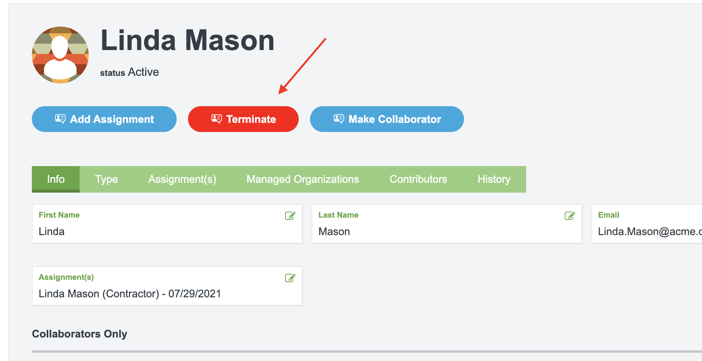

# Branding Tips

## Introduction

SecZetta allows you to upload a custom.css file that gets added to every page that will load within the tool. This document talks about some useful tips and tricks to utilize this custom css to its fullest

## Change a workflow button color

The buttons that execute a workflow look like this in HTML form

```html
<a data-id="d2ef758b-026e-446c-9790-f326919f2eaa" href="/neprofile_dashboard/workflows/d2ef758b-026e-446c-9790-f326919f2eaa/workflow_sessions/new?pid=d195b829-f327-4fa4-aca6-6e4af33b5b42">
    <li class="btn-request">
        <div class="icon-requests"></div>
        Terminate
    </li>
</a>
```

If you want to change the color of that button. You actually have to do it on the child `li` element with the class `btn-request`. Each workflow itself will have an `id`. That id is what is show under the `data-id` attribute on the `a` element. You can see above that the workflow in question has an id of `d2ef758b-026e-446c-9790-f326919f2eaa`. So we can use a css selector with a child element selector as shown below to change the background color of that workflow button:

```css
a[data-id="d2ef758b-026e-446c-9790-f326919f2eaa"] > li{
    background: red !important;
}
```

### Result



## Form Header in HTML Text Element

```html
<p class="margin-bottom-small pb_form_heading">Form Title</p>
<hr>
```


## Format Bullets so they look decent

For whatever reason, our HTML form element isnt really full HTML. It limits what you can do, and also strips out specific HTML elements. Here is a good starting point to get something that looks decent

```html
<p style="margin-bottom:10px;">Here is the current list of People:</p>

<ul style="list-style-type:circle;padding:0px 0px 20px 30px;">


<li style="margin:5px 0px 5px 0px;">{{person.name}} - has blue hair</li> 

<li style="margin:5px 0px 5px 0px;">{{person.name}} - doesn't have blue hair</li> 


</ul>
```

Notice the margin  on the `ul` element as well as the `li` elements.

Here is another example that you can just paste directly into your HTML form field. Got rid of the liquid fors and ifs
```html
<p style="margin-bottom:10px;">Here is the current list of People:</p>

<ul style="list-style-type:circle;padding:0px 0px 20px 30px;">
    <li style="margin:5px 0px 5px 0px;">Taylor has blue hair</li> 
    <li style="margin:5px 0px 5px 0px;">Cassie doesnt have blue hair</li> 
    <li style="margin:5px 0px 5px 0px;">Jen doesnt have blue hair</li> 
    <li style="margin:5px 0px 5px 0px;">Brock doesnt have blue hair</li> 
    <li style="margin:5px 0px 5px 0px;">Paul doesnt have blue hair</li> 
</ul>
```

### Result
Here is the result. Nothing fancy, but better than if you just did the standard HTML for `<ul>` and `<li>`


## Hide Profile Tab on dashboard

The following CSS will remove the profile tab with the given href. Notice this example will hide a profile type with id = `743f55e6-3bfc-4127-88bb-ddcdee287397`. So you can likely just copy the below CSS and replace the ID with the ID of the profile type you want to hide.

```css
a[href="/neprofile_dashboard/filter?filter=profiles&p_type=743f55e6-3bfc-4127-88bb-ddcdee287397"] {
  display: none !important
}
```

<p style="margin-bottom:10px;">Here is the current list of Property Access Admins:</p>

<ul style="list-style-type:circle;padding:0px 0px 20px 30px;">


<li style="margin:5px 0px 5px 0px;">{{person.name}} - {{person.non_associate_property}}</li> 

<li style="margin:5px 0px 5px 0px;">{{person.name}} - Above Property</li> 


</ul>