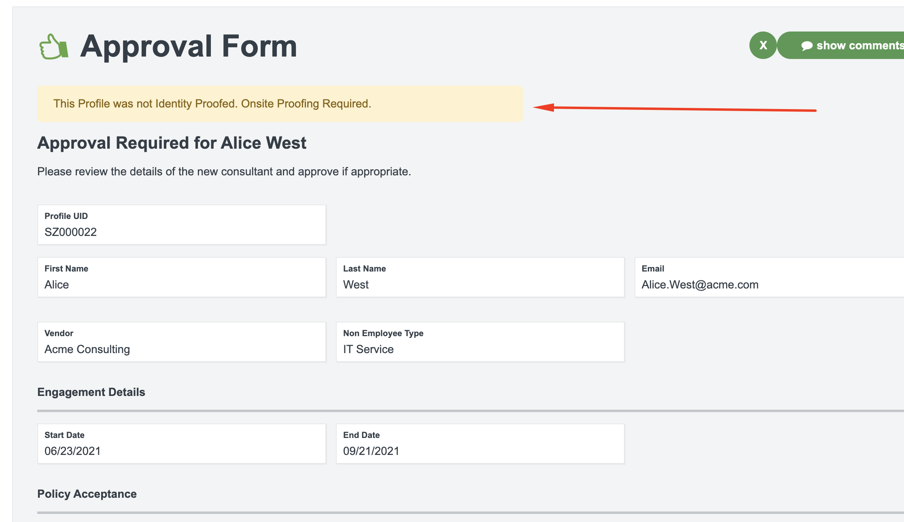

# Liquid Reference Guide

## Introduction

Liquid is used inside SecZetta to help display profile attributes in `Pages`,`Notifications`, and `Rest API Actions` . The liquid syntax allows you to easily access specific data attributes based on the current context. Currently the three SecZetta objects listed above are where liquid is used. The team is always expanding the use of liquid throughout the product, so upcoming versions could have this being used in other places as well.

Liquid accomplishes this by using a combination of objects, tags, and filters to display, check and maniuplate data

## Objects

The basic Liquid syntax uses the `{{ }}` syntax. For SecZetta, the majority of the time you will use something like `{{ attribute.first_name }}`. This would return the value of the first_name attribute of the current request or profile.

This syntax can be used in Workflow pages with any component in the `Text` collection of a workflow page. This includes:

* Large / Med / Small Headers
* Form Headers
* Paragraphs
* HTML

There are a few different types of liquid type objects that you will see within the SecZetta solution. The list below is ranked from most used to least used:

* `attribute` - this object will be the primary way you will display data about a profile on a page or notification
* `profile` - this object will be used to update the profile pages of a profile type. *Note: `attribute` will **NOT** work on profile pages*
* `request` - used in notifications to get the actual request object itself. Attributes lke created_at,  status, current_action, and coments are used
* `requester` - used in notifications to get current requester. Attributes like name, email, title, and login are available
* `approver` - used in notifications to get the approver (if any) that has made a decision. Approver is very similar to requester so attributes like name, email, title, and login are available *(TODO: check to see what happens if multiple approval steps are in a workflow)*
* `workflow` - used in notification to get the current workflow this email notification is being called from (`{{workflow.name}}` is primarily used)

## Tags 

Tags create the logic and control flow for templates. The curly brace percentage delimiters `` and the text that they surround do not produce any visible output when the template is rendered. This lets you assign variables and create conditions or loops without showing any of the Liquid logic on the page.

These tags are very useful in a SecZetta context to manipulate data before showing it or sending it to an external system.

Tags can be categorized into four various types:
* Control flow
* Iteration
* Template
* Variable assignment

### Control Flow
Control flow tags create conditions that decide whether blocks of Liquid code get executed.

#### if

Executes a block of code only if a certain condition is true.

###### Input

```

  These shoes are awesome!

```
###### Output

```
These shoes are awesome!
```

#### unless

The opposite of if – executes a block of code only if a certain condition is not met.

###### Input

```

  These shoes are not awesome.

```
###### Output

```
These shoes are not awesome.
```

This would be the equivalent of doing the following:

```

  These shoes are not awesome.

```


#### elsif / else

Adds more conditions within an if or unless block.

###### Input

```
<!-- If customer.name = "anonymous" -->

  Hey Kevin!

  Hey Anonymous!

  Hi Stranger!

```

###### Output

```
Hey Anonymous!
```

### Iteration

Iteration tags repeatedly run blocks of code.

#### for

Repeatedly executes a block of code. For a full list of attributes available within a for loop, see forloop (object).

###### Input

```

  {{ product.title }}

```

###### Output

```
hat shirt pants
```

#### else

Specifies a fallback case for a for loop which will run if the loop has zero length.

###### Input

```

  {{ product.title }}

  The collection is empty.

```

###### Output

```
The collection is empty.
```

#### break

Causes the loop to stop iterating when it encounters the break tag.

###### Input

```

  
    
  
    {{ i }}
  

```

###### Output

```
1 2 3
```

#### continue

Causes the loop to skip the current iteration when it encounters the continue tag.

###### Input

```

  
    
  
    {{ i }}
  

```

###### Output

```
1 2 3   5
```

## Advanced Concepts

### Working with Profile Select/Search attributes

Let's say you have a 2 profile types in your environment `Vendors` and `People`. The People profile type has a relationship to the Vendors profile type using the attribute `vendor`. Now lets say you wanted to get the `contact_email` from the Person's Vendor. 

Here is how you would do that, assuming you want to display the contact_email in a workflow page for this example. The liquid code would be:

```
{{ attribute.vendor.first.contact_email }}
```

Notice the `.first` in the code above. This is important because SecZetta treats all of the profile select and profile search attributes as arrays, if you know for sure that there is only one profile in this profile select attribute, you are safe to use the `.first` method.

### Display Tags on Profile Pages

This is likely a non-standard use case, but could be a nice addition to any deployment. In this case we want to have a few tags (sometimes called badges) on the profiles themselves. 

Here is an example of what we are looking to do:


> Notice the 5 tags shown below the `Info` tab*

This is easily accomplished using liquid and some basic HTML styling. In your Profile Type Profile page add an HTML component to the top of the page. The style was taken from bootstrap badges. You can find that reference [here](https://getbootstrap.com/docs/4.0/components/badge/#contextual-variations)

In that HTML component paste the following code:
```html






  <p style="display:inline-block;padding:.75em .75em;font-size:10px;font-weight:700;line-height:1;text-align:center;white-space:nowrap;vertical-align:baseline;border-radius:.25rem;color:#fff;background-color:#dc3545;">
  {{flag}}
  </p>

  <p style="display:inline-block;padding:.75em .75em;font-size:10px;font-weight:700;line-height:1;text-align:center;white-space:nowrap;vertical-align:baseline;border-radius:.25rem;color:#fff;background-color:#007bff;">
  {{flag}}
  </p>





<p style="display:inline-block;padding:.75em .75em;font-size:10px;font-weight:700;line-height:1;text-align:center;white-space:nowrap;vertical-align:baseline;border-radius:.25rem;color:#fff;background-color:#007bff;">
IAM
</p>



<p style="display:inline-block;padding:.75em .75em;font-size:10px;font-weight:700;line-height:1;text-align:center;white-space:nowrap;vertical-align:baseline;border-radius:.25rem;color:#fff;background-color:#007bff;">
Vendor PAM
</p>


```

The styling in the paragraph is based off of bootstrap and the colors can be changed to whatever you want. 

There are 3 attributes that are being used in this liquid code:

* `profile_flags` - this attribute is of type `checkbox` and allows administrators to set certain flags like `Do Not Hire` or `Privileged`. Notice you have to `split` the attribute on a commad because by default it will contain a comma deliminted list

> Referring to this line: ``

* `my_iam_id` - this attribute contains an ID for your IAM system. The point of this is to show on the profile very quickly whether or not a profile has an IAM account or not

* `my_other_id` - this is just another example of how you can add mulitple conditions to create multiple flags for your customers

### Display Banner on Workflow Pages

This is very similar to displaying badges on the profile pages. However, this will be a full width banner at the top of a workflow page (or a profile page if required).

Here is what it looks like when configured correctly:



The use case here is we want to show a banner depending on whether or not the profile has been identity proofed. In our case, we actually have a new attribute called `idp_status` that we are setting manually in the workflow. The banner text will change based on the value of that attribute.

If they have `Passed` Identity Proofing the banner would say:
```
This Profile has Passed< Identity Proofing on June 1st, 2021
```
Otherwise it will say: (as the example shown above does)
```
This Profile was not Identity Proofed. Onsite Proofing Required.
```

```html

<p style="color:#155724;background-color:#d4edda;border-color:#c3e6cb;border-radius:5px;padding:.75rem 1.25rem;margin-bottom:0px;">
This Profile has <b>Passed</b> Identity Proofing on {{attribute.idp_date_proofed}}
</p>

<p style="color:#856404;background-color:#fff3cd;border-color:#ffeeba;border-radius:5px;padding:.75rem 1.25rem;margin-bottom:0px;">
This Profile was not Identity Proofed. Onsite Proofing Required.
</p>

```