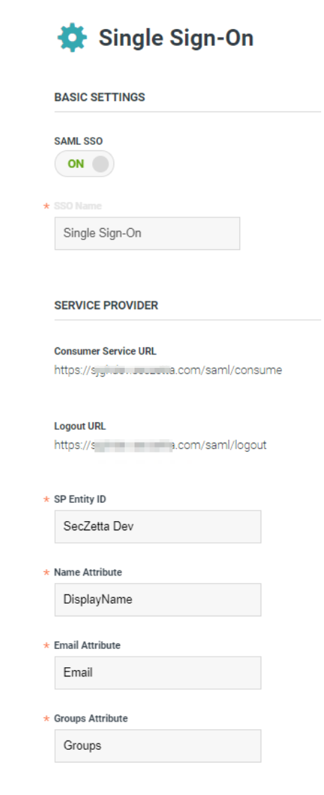
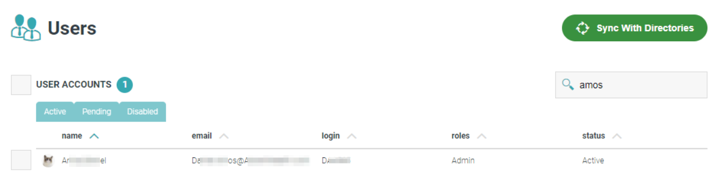
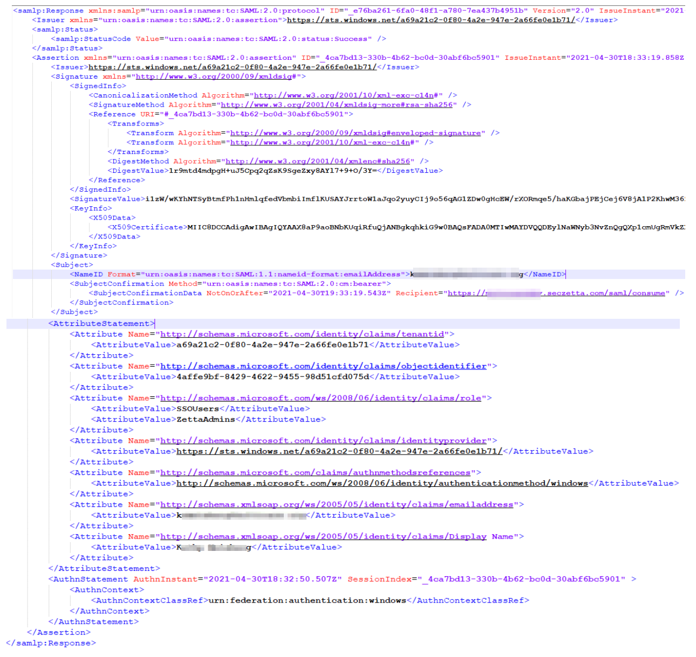
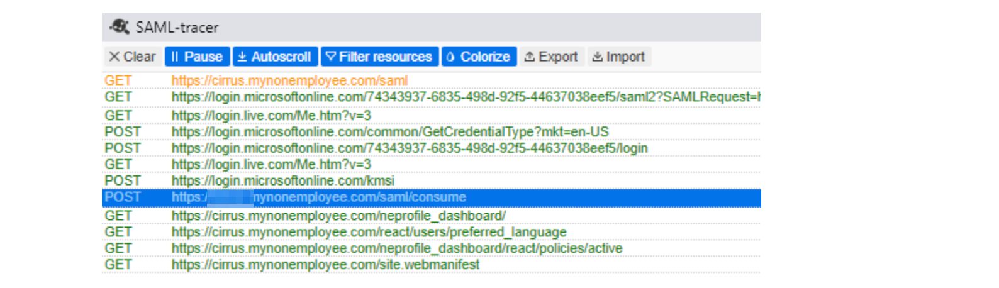

# SSO Configuration Guide

## Contents

### Setup

#### Configure SecZetta SSO

1. On the `Admin` side of SecZetta: Navigate to System &#8594; Authentication
2. Click the `SSO` tab at the top of the screen
3. Toggle SAML SSO from `OFF` to `ON`
4. Enter the following values into the left half of the page. These values for SP Entity ID and the other attributes are case sensitive and need to be lowercase

Field             | Development    | Test           | Production
------------------|----------------|----------------|----------------
SSO NAME          | Single Sign-On | Single Sign-On | Single Sign-On
SP ENTITY ID      | seczettadev    | seczettatest   | seczettaprod
NAME ATTRIBUTE    | displayname    | displayname    | displayname
EMAIL ATTRIBUTE   | email          | email          | email
GROUPS ATTRIBUTE  | groups         |      groups    | groups

5. Click the `SP SAML Data` button to download the XML metadata file
6. After clicking the button, you will notice two new values appear on the screen, Consumer Service URL and Logout URL. The screen should resemble something like below:




#### Configure the Identity Provider

At this point, the Identity Provider (IDP) needs to be configured. Typically our customers are the ones configuring their IDP, so the metadata file downloaded above should be given to the appropriate team on the customer side to allow this configuration to occur. When finished, the customer will return a different metadata file that needs to be imported into SecZetta. See below once you have a new metadata file frome the IDP

#### Import the Identity Provider's Metadata File

1. Save this new metadata file locally before you begin. Then proceed using the following steps
1. On the `Admin` side of SecZetta: Navigate to System &#8594; Authentication
1. Click the `SSO` tab at the top of the screen
1. In the `Identity Provider` section heading. At the very bottom of the page you should see a field labeled `Import File` with a `+` next to the text field. Click that button and browse for your metadata file you saved in step 1.
1. Once imported, the blank fields will show the values contained in the file

#### Confirmation

If a user role has not already been created for Administrators, make one and assign it a Directory group to which an Administrator belongs. Ask the client’s administrator to log in using SSO. If successful, you should see a new user with valid name, email, login, and role(s) as shown in the image below. 



### Troubleshooting

#### SAML Assertion

A SAML trace captures the SAML assertion (response) returned to the SecZetta application by the Identity Provider. Ensure a `<NameID>` tag is present. Also check the attributes sent in the `<AttributeStatement>` tag. See below for examples

```xml
<samlp:Response xmlns:samlp="urn:oasis:names:tc:SAML:2.0:protocol" xmlns:saml="urn:oasis:names:tc:SAML:2.0:assertion" ID="_8e8dc5f69a98cc4c1ff3427e5ce34606fd672f91e6" Version="2.0" IssueInstant="2014-07-17T01:01:48Z">
  <saml:Issuer>http://idp.example.com/metadata.php</saml:Issuer>
  <samlp:Status>
    <samlp:StatusCode Value="urn:oasis:names:tc:SAML:2.0:status:Success"/>
  </samlp:Status>
  <saml:Assertion xmlns:xsi="http://www.w3.org/2001/XMLSchema-instance" xmlns:xs="http://www.w3.org/2001/XMLSchema" ID="_d71a3a8e9fcc45c9e9d248ef7049393fc8f04e5f75" Version="2.0" IssueInstant="2014-07-17T01:01:48Z">
    <saml:Issuer>http://idp.example.com/metadata.php</saml:Issuer>
    <Signature xmlns="http://www.w3.org/2000/09/xmldsig#">
        <SignedInfo>
            <CanonicalizationMethod Algorithm="http://www.w3.org/2001/10/xml-exc-c14n#"/>
            <SignatureMethod Algorithm="http://www.w3.org/2000/09/xmldsig#rsa-sha1"/>
            <Reference URI="#_c7cb47c9-d4dc-4535-b7d9-7e0cb50c1d64">
                <Transforms>
                    <Transform Algorithm="http://www.w3.org/2000/09/xmldsig#enveloped-signature"/>
                    <Transform Algorithm="http://www.w3.org/2001/10/xml-exc-c14n#">
                        <InclusiveNamespaces xmlns="http://www.w3.org/2001/10/xml-exc-c14n#" PrefixList="#default samlp saml ds xs xsi"/>
                    </Transform>
                </Transforms>
                <DigestMethod Algorithm="http://www.w3.org/2000/09/xmldsig#sha1"/>
                <DigestValue>i17i0FeuWOQE1RQd2DgJhN2Q8A4=</DigestValue>
            </Reference>
        </SignedInfo>
        <SignatureValue>KqzSp8jCK7LEAg6wqLAGYGDqwB1B4O6LRpqYcY1kH8yIDOyKFt9pu2pA3glxXN516dtg5VrmrJLxxE9G7zDxZbgyUOuHU1sg+WcNDqV0l3zIdCYZViPRmwpJSwQ5ljrI+GE22zPi8go0GCpvvSetc2p0b6BaApJp9Fw9wbY1tUU=<SignatureValue>
        <KeyInfo>
            <X509Data>
            <X509Certificate>MIIBnjCCAQcCBEbTmdAwDQYJKoZIhvcNAQEEBQAwFjEUMBIGA1UEAxMLd3d3LmlkcC5jb20wHhcNMDcwODI4MDM0MzEyWhcNMTcwODI1MDM0MzEyWjAWMRQwEgYDVQQDEwt3d3cuaWRwLmNvbTCBnzANBgkqhkiG9w0BAQEFAAOBjQAwgYkCgYEAo31q3mJZayXfZkLDuLcnanc/KG+RDFW+OlYDP+RubvWnt8X5jtiUTcp8IQ46TNEUFskmsonUb5AnG+zOCcawb2dJr8kBtCNhfi/TufZGBQNjuAxNMi34yIgRdGinaznHgclrAIIZTyKerQqYjPL1xRDsFGpzqGGi/2opzN8nV5kCAwEAATANBgkqhkiG9w0BAQQFAAOBgQBmNwFN+98aybuQKFJFr69s9BvBVYtk+Hsx3gx0g4e5sLTlkcSU03XZ8AOet0my4RvUspaDRzDrv+gEgg7gDP/rsVCSs3dkuYuUvuWbiiTq/Hj4EKuKZa8nIerZ3Oz4Xa1/bK88eT7RVsv5bMOxgJbSEvTidTvOpV0G13duIqyrCw==</X509Certificate>
            </X509Data>
        </KeyInfo>
    </Signature>
    <saml:Subject>
      <saml:NameID Format="urn:oasis:names:tc:SAML:1.1:nameid-format:emailaddress">John.Doe@email.com</saml:NameID>
      <saml:SubjectConfirmation Method="urn:oasis:names:tc:SAML:2.0:cm:bearer">
        <saml:SubjectConfirmationData NotOnOrAfter="2024-01-18T06:21:48Z" Recipient="http://sp.example.com/demo1/index.php?acs" InResponseTo="ONELOGIN_4fee3b046395c4e751011e97f8900b5273d56685"/>
      </saml:SubjectConfirmation>
    </saml:Subject>
    <saml:AttributeStatement>
      <saml:Attribute Name="http://schemas.microsoft.com/identity/claims/tenantid">
        <saml:AttributeValue>9a6ffd49-5300-42b2-89d1-cd7df95e003f</saml:AttributeValue>
      </saml:Attribute>
      <saml:Attribute Name="http://schemas.microsoft.com/identity/claims/objectidentifier">
        <saml:AttributeValue>9a6ffd49-5300-42b2-89d1-cd7df95e003f</saml:AttributeValue>
      </saml:Attribute>
      <saml:Attribute Name="http://schemas.microsoft.com/identity/claims/role">
        <saml:AttributeValue>SSO Users</saml:AttributeValue>
        <saml:AttributeValue>SecZetta Admins</saml:AttributeValue>
      </saml:Attribute>
      <saml:Attribute Name="http://schemas.microsoft.com/identity/claims/identityprovider">
        <saml:AttributeValue>https://sts.windows.net/my-demo-id</saml:AttributeValue>
      </saml:Attribute>
      <saml:Attribute Name="http://schemas.microsoft.com/identity/claims/authnmethodreferences">
        <saml:AttributeValue>http://schemas.microsoft.com/ws/2008/06/identity/authenticationmethod/windows</saml:AttributeValue>
      </saml:Attribute>
      <saml:Attribute Name="http://schemas.microsoft.com/identity/claims/emailaddress">
        <saml:AttributeValue>John.Doe@example.com</saml:AttributeValue>
      </saml:Attribute>
      <saml:Attribute Name="http://schemas.microsoft.com/identity/claims/Display Name">
        <saml:AttributeValue>John Doe</saml:AttributeValue>
      </saml:Attribute>
    </saml:AttributeStatement>
  </saml:Assertion>
</samlp:Response>
```



#### Install a tracer

A trace can only be performed locally, therefore the Administrator asked to test connectivity will need a plugin installed. For Chrome, add an extension like [SAML-tracer](https://chrome.google.com/webstore/detail/saml-tracer/mpdajninpobndbfcldcmbpnnbhibjmch?hl=en).  

#### Run a trace

Once installed, open the trace window by clicking the extension’s icon  Ask the tester to try to login using SSO. If unsuccessful, take a look at the trace window and locate the row POST https://subdomain.domain.com/saml/consume. Click this row to view the SAML response.



#### Common Problems

Below is a list of some common problems you may see when configuring SSO in SecZetta

1. Atribute Names

Some identity providers pass full schema names instead of short strings, like Email was in the previous example. 

```xml
    <Attribute Name="http://schemas.xmlsoap.org/ws/2005/05/identity/claims/emailaddress">
        <AttributeValue>John.Doe@email.org</AttributeValue>
    </saml:Attribute>
```

In this event, the SecZetta SSO configuration can be changed to map the Email Attribute to http://schemas.xmlsoap.org/ws/2005/05/identity/claims/emailaddress. This can be done for any of the attributes passed.

2. Fingerprint Algorithm

Always check to make sure the fingerprint algorithm matches from SecZetta to the IDP. For example: if the Identity Provider is using RSA-SHA256, make sure that is selected in the Fingerprint Algorithm drop down field.