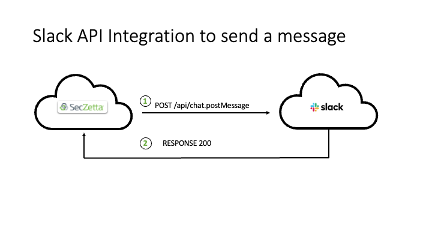

# SecZetta / Slack Integration

## Contents

- [SecZetta / Slack Integration](#seczetta-slack-integration)
  - [Overview](#overview)
    - [Architecture Overview](#architecture-overview)
  - [Supported Features](#supported-features)
  - [Prerequisites](#prerequisites)
  - [High Level Architecture](#High-Level-Architecture)
    - [API Integration](#API-Integration)
  - [Configuration Parameters](#Configuration-Parameters)
    - [Slack Configuration](#Slack-Configuration)
      - [Create a Slack Application and Obtain Authorization Token](#Create-a-Slack-Application-and-Obtain-Authorization-Token)
      - [Create an Unique Slack Email Address for a Slack Channel](Create-an-Unique-Slack-Email-Address-for-a-Slack-Channel)
      - [Remarks](Remarks)
    - [SecZetta Configuration](#SecZetta-Configuration)
      - [SecZetta Update Workflow Configuration to retrieve Slack ID](#SecZetta-Update-Workflow-Configuration-to-retrieve-Slack-ID)
        - [Workflow Permissions Retrieve Slack ID](#Workflow-Permissions-Retrieve-Slack-ID)
      - [SecZetta Batches Workflow Configuration to Update People Profile Records](#SecZetta-Batches-Workflow-Configuration-to-Update-People-Profile-Records)
        - [Workflow Permissions Update Profile Records](#Workflow-Permissions-Update-Profile-Records)
      - [SecZetta Workflow Configuration to send a Slack Message](#SecZetta-Workflow-Configuration-to-send-a-Slack-Message)
        - [Workflow Permissions Send Slack Message](#Workflow-Permissions-Send-Slack-Message)
        - [Remarks](Remarks)

## Overview

The main purpose of the SecZetta / Slack integration is:

- Notifications from SecZetta Life Cycle events to a slack channel and/or individual users.
- Planned enhancements for 2022 allows for other type integrations, as Slack will support deeper workflow integrations. For example we can initiate workflow approvals through slack versus or have the a workflow start in slack and have it fulfilled by SecZetta.

## Supported Features

The SecZetta / Slack integration is configured as an REST API integration in a workflow versus an email notification.

Alternatively Slack supports email notification to a channel and/or DM by using the mail integration and an unique email address is created for each channel or DM.

## Prerequisites

- Slack:
  - Administrative access in Slack
  - Create an Application in Slack to obtain an authorization token (Bot or an Application token)
  - Create a manifest for the application with `chat.write` for the oauth scope
  - if you want to send message to channels the application needs to be added to the respective channel as an integration. Alternative you can add the following oauth scopes `chat:write.customize` and `chat:write.public` to the application permissions.
  - Install the application into the slack environment
  - Add the `users:read` , `users:read.email` and `users.profile:read` OAuth scopes to the application to be able to read the user profile information based on the SZ email addresss and obtain the slack ID through an Slack API call so you can store the value in the SecZetta People Profile
- SecZetta
  - Create an attribute to store the Slack ID or Slack User name of the user (people profile)
  - Create a `batches` workflow to obtain the slack id or user name from all relevant slack users and store it in the associated people profile
  - Create an `update` workflow that will act as a sub routine to be called from the batches workflow to get the Slack ID of the user and pass it back to the batches workflow
  - Create a workflow to use the API call to send the message to a slack channel or slack user
  - For email integration with a specific channel or DM, create an unique email address to be used in a SZ Email notification     

## High Level Architecture

### API Integration



## Configuration Parameters

This section provides the required configuration for the features described above:

### Slack Configuration

The application configuration requires Slack administrative accces to be able to execute the steps below.

#### Create a Slack Application and Obtain Authorization Token

To obtain an authorization token that is used in a SecZetta workflow to send a slack message, go to the slack console to create a new application, located at https://api.slack.com/apps. Follow the steps below to create the new application:

- Click on the `Create New App` button:
- You can chose to either create the App from scratch or create it from an existing app manifest. The easier option is to use the manifest file that is stored in the Github respository for this integration. An example manifest file (YAML) is shown below and located in the github repository /img folder: 

```code
_metadata:
  major_version: 1
  minor_version: 1
display_information:
  name: `SecZetta Integration`
features:
  bot_user:
    display_name: `SecZetta Bot`
    always_online: false
oauth_config:
  scopes:
    bot:
      - chat:write
      - chat:write.customize
      - chat:write.public
      - users:read
      - users:read.email
      - users.profile:read
settings:
  org_deploy_enabled: false
  socket_mode_enabled: false
  token_rotation_enabled: false
```

The `name` field indicates the name of the application and the `display_name` is what shows up in the slack interface as the bot name, see below:


`Note:` You can add a logo if you like, but it needs to be between 512 and 2000 pixels and no larger than 16mb.

- Next you are asked about the slack workspace you want to develop your application in. Select the workspace you want to use.
- Next you are shown a default app manifest file You can copy the content of the provided manifest yml file. Update the `name` and `display_name` fields if so desired and no application with the same name exists in the workspace.
- Next you are shown a summary of the application oauth permissions and features and if these are correct, then press the `Create` button.
- Next you are shown the full manifest of the application in the Basic Information section of the application.
- Next go to the OAuth & Permission Section on the screen and a message appears that to get your token, you need to install the app into the workspace first.
- Next install the application into the workdspace by selecting the button to do so.
- After the install is succesful, you see the `Bot User Oauth Token` displayed and you can use the `Copy` button to copy the token value as you need it for the configuration of the SecZetta workflow to send a Slack message.

Note: Any changes to the OAuth permissions requires the application to be reinstalled in the workspace.

#### Create an Unique Slack Email Address for a Slack Channel

To create an email address for a Slack Channel (or DM) take the following steps:

- Open the channel (or DM) on your desktop
- Click the channel or member name(s) in the conversation header 
- Click the `Integrations` tab. 
- Select `Send emails to this channel or conversation`. 
- Click `Get Email Address`. 

You can now use the email address in a SZ Email Notification to send the message to this Slack Channel (or DM).

#### Remarks

This concludes the Slack configuration.


### SecZetta Configuration

The configuration on the SecZetta side requires administrative accces to be able to configure the workflows get the Slack ID of the user and so it can be used to send the slack message. 

#### SecZetta Update Workflow Configuration to retrieve Slack ID

To be able to send a Slack message to a user we need to retrieve the Slack ID or Name of the Slack account and store it in an SZ attribute. To be able to obtain the Slack ID of a user use the Slack API called `users.lookupByEmail` and provide the email address on the API call using liquid to reference the email attribute of the user using `{{attribute.email}}`. 

>For example:
`https://slack.com/api/users.lookupByEmail?email={{ attribute.email }}`

Create a new `Update` workflow and select REST API as the only action in the workflow so it can be called from other workflow.

To Configure the REST API parameters, use the folllowing table below:

Parameter | Description
--------- | --------------
BASIC SETTINGS |
Description | Provide a description of the REST API
AUTHENTICATION
Auth Type | None
REQUEST |
HTTP Verb | GET
End point | `https://slack.com/api/users.lookupByEmail?email={{ attribute.email }}`
Headers |
Content-Type | application/x-www-form-urlencoded
Authorization | Bearer Token Value
Json Body | {}
RESPONSE |
Status Code Mapping | You may want to map the response code of the API
Data Mappings(s) |
Path | user id
Attribute | slack_account (this is the new text attribute to store the Slack ID value in)

> An Example of this workflow can be found here: https://paulsandbox.mynonemployee.com/neprofile_admin/workflows/6e2c2270-29ce-4bb7-aa01-ba3da120b38f/workflow_actions/cd628f1b-bef1-48ca-b550-ce0bfb76dfe1

##### Workflow Permissions Retrieve Slack ID

The workflow requires no permissions as it is meant to be executed as a sub routine.

#### SecZetta Batches Workflow Configuration to Update People Profile Records

To be able to update the people profile records I suggest to create a `Batches` workflow to select the people profiles that have no Slack ID in their profile and then manually select the profiles that you want to update with their Slack ID so you can send them a message.

Create a new `Batches` workflow and configure the parameters as defined in the table below:

Parameter | Description
--------- | --------------
Name | Give the workflow a name that is reflective of the function performed
UID | value is automatically assigned by SZ
Make all profiles available | Select Yes
Create a new request for each profile selected | Select Yes 
Description | Provide a description of the REST API
Position | Pick a number
Conditions | Add the condition to check if the Slack Account profile attribute is absent

> An Example of this workflow can be found here: https://paulsandbox.mynonemployee.com/neprofile_admin/workflows/aa337e43-6db9-447a-85f2-89cd4d8ae217/actions

##### Workflow Permissions Update Profile Records

The workflow permissions are assigned to admins or need to be assigned to anybody that needs to update these profile records.

#### SecZetta Workflow Configuration to send a Slack Message

Create a new `Create` workflow and select REST API as the only action in the workflow so it can be called from other workflow.

To Configure the REST API parameters, use the folllowing table below:

Parameter | Description
--------- | --------------
BASIC SETTINGS |
Description | Provide a description of the REST API
AUTHENTICATION
Auth Type | None
REQUEST |
HTTP Verb | POST
End point | `https://slack.com/api/chat.postMessage`
Headers |
Content-Type | application/json; charset=utf-8
Authorization | Bearer Token Value
Json Body | See below for JSON Example
RESPONSE |
Status Code Mapping | You may want to map the response code of the API
Data Mappings(s) | N/A

##### JSON Exmaple

```json
{
  "Text": "slack message to send",
  "channel": "slack channel name/id or slack username/id"  
}
```

> Note: you can use liquid in both the text of the slack message and the channel as we have the slack user id stored in an SZ attribute.

##### Workflow Permissions Send Slack Message

The workflow requires no permissions as it is meant to be executed as a sub routine.

#### JSON Examples using Liquid to send a message

The JSON examples below shows how to use liquid for arguments to be send within a slack message.

##### Example 1 - Send Message to a Slack User

This example send the profile name that is created during the execution of the workflow to the requestor using the Slack ID stored in the referenced SZ attribute.

```json
{
    "text" : "Profile for  {{ profile.name }} has been created",
   "channel" : "{{ attribute.slack_account_ne_attribute }}"
}
```

##### Example 2 - Send Message to a Slack Channel

This example send the profile name that is created during the execution of the workflow to the `general` Slack channel using the name of the Slack channel versus the Slack ID of the channel.

```json
{ 
    "text" : "Profile for  {{ profile.name }} has been created", 
    "channel" : "general"
} 
```

#### Remarks

This concludes the SecZetta configurations.